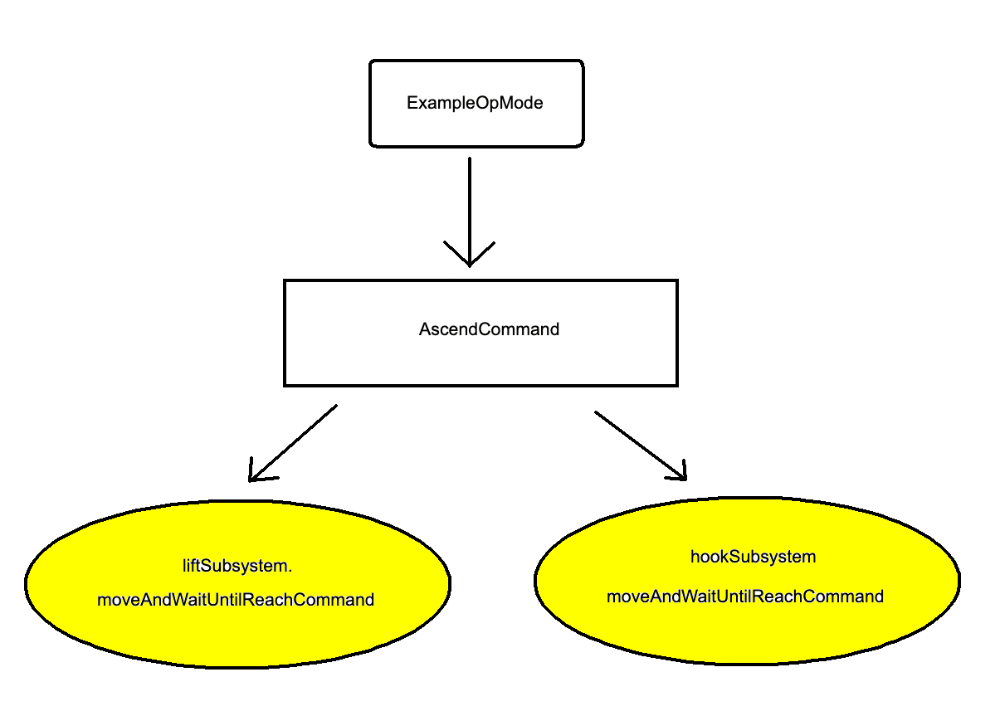

### RobotHardware
- This is a "singleton" which gives access to hardware components and subsystems physically on the robot.
- The hardware mapping is defined in this class for the whole project.
- In any OpMode, simply call `RobotHardware.getInstance()` once to obtain a fully configured robot instance.

In this example project, RobotHardware instantiates the following hardware:
```
DcMotorEx liftMotor;
Servo hookServo;	

LiftSubsystem liftSubsystem;
HookSubsystem hookSubsystem;
```

### Subsystems
- A subsystem is an assembly of components that work together as a unit mutually independent of other subsystems. The purpose is to provide "commands" that can be called to perform complex actions and contain all the action logic. In our example, both `LiftSubsystem` and `HookSubsystem` provide the `moveAndWaitUntilReachCommand`. But they can obviously provide any number of commands.
- Each subsystem in this project extends FTCLib's `SubsystemBase`
- Just like RobotHardware, there can only be one instance of each subsystem. The best way to access each subsystem is through the RobotHardware instance, as opposed to calling the subsystem's getInstance method directly.

### Robot Commands
- In this example, we define one very complex robot command called `AscendCommand` whose purpose is to carry out the ascend task.
- Internally, the command calls each subsystem's commands to orchestrate the timing and order of operations.
- Similar to the AscendCommand, any number of very complex commands can be "composed" to create interesting robot behavior.

### Architecture Diagram
This is a high-level diagram of how commands are composed to create the ExampleOpMode.


